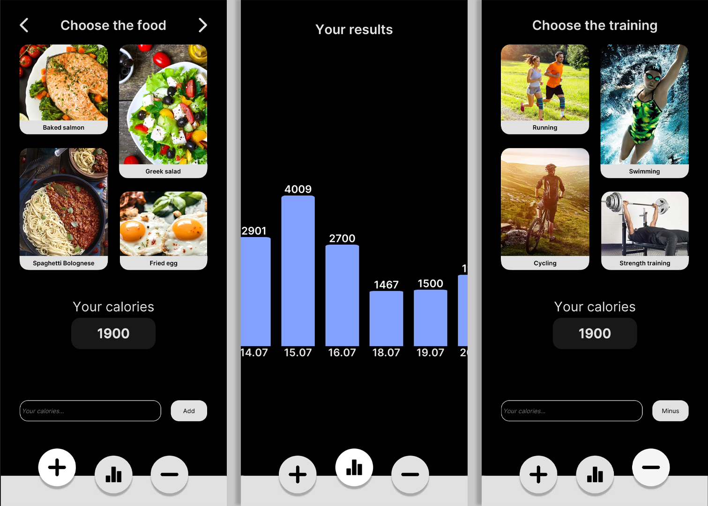

# Calories Manager
Calories Manager - приложение для подсчета ежедневно потребляемых/сжигаемых калорий.

В Calories Manager имеется 3 основных окна:
+ **Окно подсчета потребляемых калорий:** здесь можно вручную добавить их количество, либо же выбрать одно из 12 блюд, после чего ввести граммовку - приложение само все подсчитает. 
+ **Окно с отображением статистики по дням:** здесь можно отслеживать свою статистику - посмотреть количество калорий, которые были получены в остальные дни (с учетом потребляемых и сжигаемых калорий). 
+ **Окно подсчета сжигаемых калорий:** можно ввести количество сожженных калорий вручную, либо же выбрать один из 4х видов физической активности, ввести длительность тренировки, программа также все подсчитает автоматически. 

____
+ **Движок:** Unity;
+ **Платформа:** IOS/Android.
